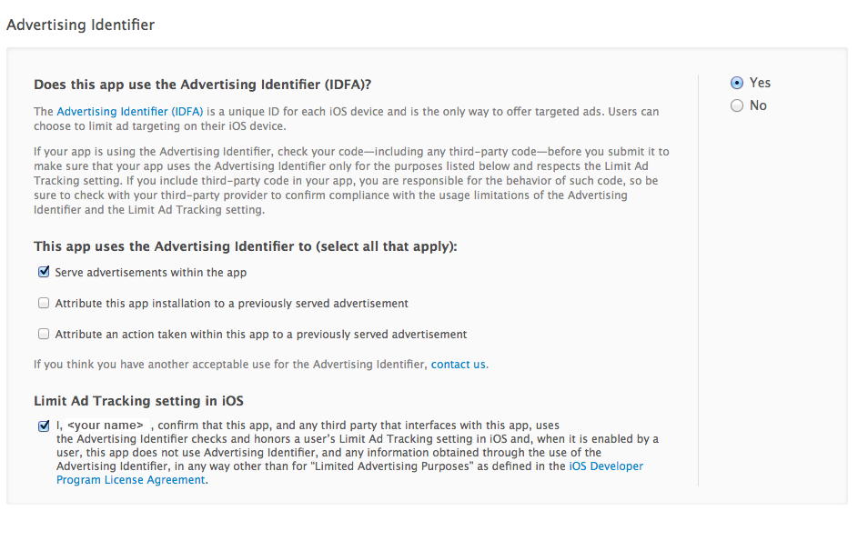
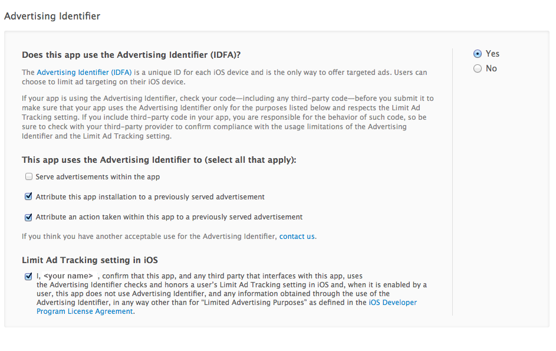

品友iOS SDK集成指南
===

----

### 一.Pinyou 固定位广告iOS SDK集成指南

#### 1. 获取广告位ID

注册自己的App并获取广告位ID`adUnitId`

#### 2. iOS SDK配置

1. 在项目中添加libPinyou.a，include/*.h和Pinyou.bundle文件。
2. 在Targets添加对libPinyou.a的依赖。
3. 在Targets中添加以下Framework

	* SystemConfiguration.framework
	* ImageIO.framework
	* CoreLocation.framework
	* CoreTelephony.framework
	* AdSupport.framework
	* MobileCoreServices.frameword

####3. 广告展示代码


####3.1 配置`AppDelegate.m`


初始化SDK,添加代码如下:

```
	- (BOOL)application:(UIApplication *)application didFinishLaunchingWithOptions:(NSDictionary *)launchOptions
{
 	[PYAdRequest initSDKWithVersion:(NSString *)SDKVersion];
}
```
#####3.2 快速展示广告

直接调用`Pinyou`的类方法

`[Pinyou showDefaultTopBannerView];`
	
#####3.3 自定义展示广告

需要自定义创建`PYBannerView`对象

```
    PYBannerView *bannerView = [[[PYBannerView alloc] initWithFrame:rect] autorelease];
    bannerView.delegate = self;
    [bannerView setAdUnitId:adUnitId];
    [layerView addSubview:bannerView];
    
    [bannerView loadAdInfo];
```
更多自定义方法请参考`PYBannerViewDelegate.h`文件.

**如果想自定义打开点击地址效果,需要通知品友,为相应广告位开通此功能**	

#####3.4 App启动画面广告

```
PYStartupView *startupView = [[PYStartupView alloc]initWithSize:CGSizeMake(640, 960)] ;
    startupView.delegate = self;
    startupView.adUnitId = @"adUnitId";
    [self.window addSubview:startupView];
    [startupView loadAdInfo];
```
若需要直接使用image物料对象也可直接使用imageView属性：
@property (retain,nonatomic) UIImageView *imageView;

_开启IDFA注意：在App提交AppStore审核时，对于IDFA的用途请按下图勾选，且在AppStore的审核人员审核操作时能看到Ad，否则App审核将被拒（无Ad不可使用IDFA）_

----

###二转化统计SDK集成指南

#### 1.导入SDK

- 下载`libPinyouSDK.a` 和 `PYConversion.h`

- 导入相关文件
> 所需文件：`libPinyouSDK.a` 和 `PYConversion.h`。在工程目录结构中，右键选择`Add->Existing Files…`，选择这两个文件。或者将这两个文件拖入XCode工程目录结构中，在弹出的界面中勾选`Copy items into destination group's folder(if needed)`, 并确保`Add To Targets`勾选相应的target。

- 配置
>添加依赖框架(Framework)和编译器选项
`TARGETS`-->`Build Phases`-->`Link Binary With Libraries`--> `+` -->`libz.dylib`,`SystemConfiguration.framework`,`Frameworks/CoreTelephony.framework`

- 添加代码
当用户首次启动应用时，向品友服务器发送用户信息，在appDelegate.m相应方法中添加代码如下

```
[[PYConversion defaultManager] noticeConversionWithParamA:@"a5.Yo" conversionTypeString:@"1234"];
```

说明：

1.`(void)noticeConversionWithParamA:(NSString *)a conversionTypeString:(NSString *)type` 需要传入两个参数：`paramA`是由品友提供的关于广告主注册公司信息加密后的a参数，`ConversionType`参数：转化目标（在优驰系统中生成的转化目标ID）。(这些都可联系对口的业务人员获取). 

2.上报数据若成功，输出成功日志` Sending request to Pinyou Completed!!`,否则打印失败日志` Sending request to Pinyou has error!!`

3.订单跟踪参数进阶。(详细可咨询接口人员)：
`(void)noticeConversionWithParamA:(NSString *)a conversionTypeString:(NSString *)type orderNo:(NSString *)orderNo;`

4.针对“Download”这个转化目标仅在app第一次启动时会上报数据，之后app再启动是不会再上报数据的

_开启IDFA注意：在App提交AppStore审核时，对于IDFA的用途请按下图勾选，说明使用IDFA是为了作为广告主要跟踪广告效果的需要（若被拒，可按此理由作为广告主身份进行申诉。）：

若按上述操作后App审核仍被拒，可开启一个临时的Ad（无Ad不可使用IDFA）,审核通过后关闭该Ad（在AppStore的审核人员审核操作时能看到Ad即可），且可发送一个带有Ad的截图进行申诉。_


_附：_

_提交App审核时若未勾上“使用了IDFA”被拒的提示如下：
` Improper Advertising Identifier [IDFA] Usage. Your app contains the Advertising Identifier [IDFA] API but you have 
not indicated its usage on the Prepare for Upload page in iTunes Connect.`_

_提交App审核是若未勾上“Limit Ad Tracking setting in iOS”被拒的提示如下：
` Improper Advertising Identifier [IDFA] Usage. Your app contains the Advertising Identifier [IDFA] API but your 
app is not respecting the Limit Ad Tracking setting in iOS.`_


#### 二.技术支持

请发邮件至 [mobile-core@ipinyou.com](mailto:mobile-core@ipinyou.com),我们会快回复您。
